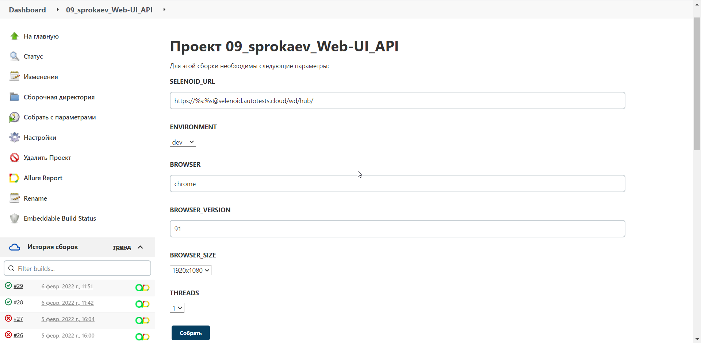
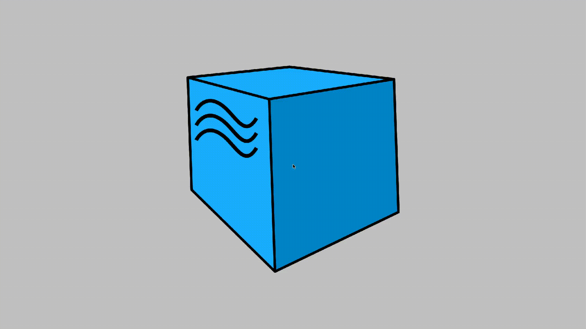
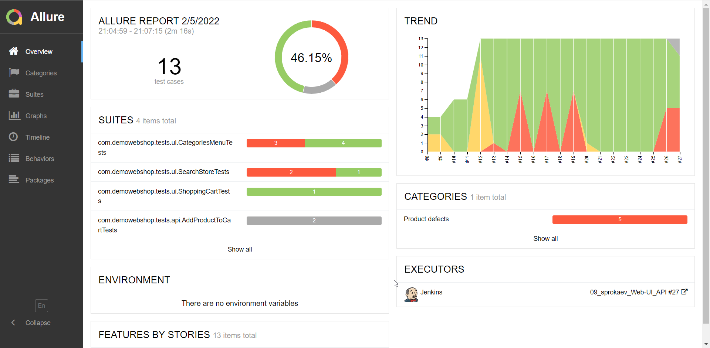
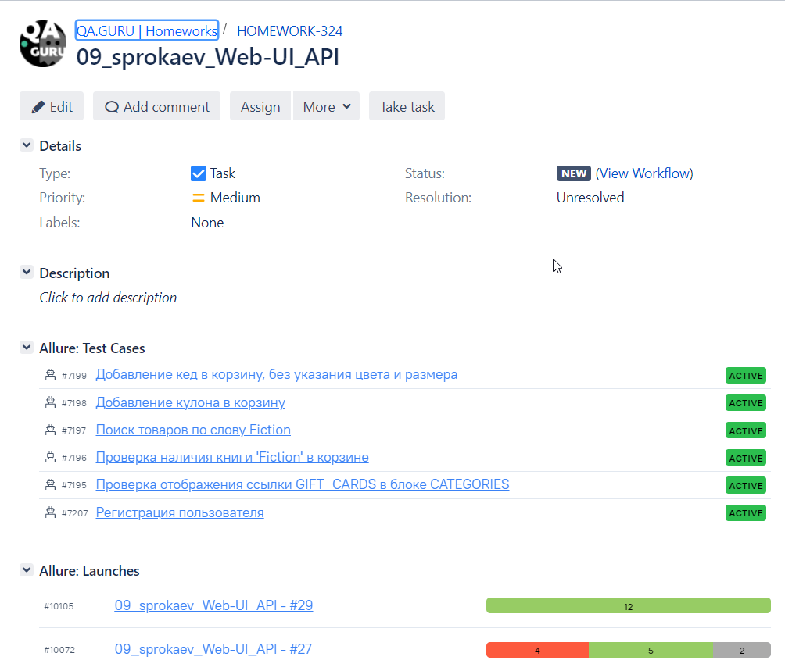
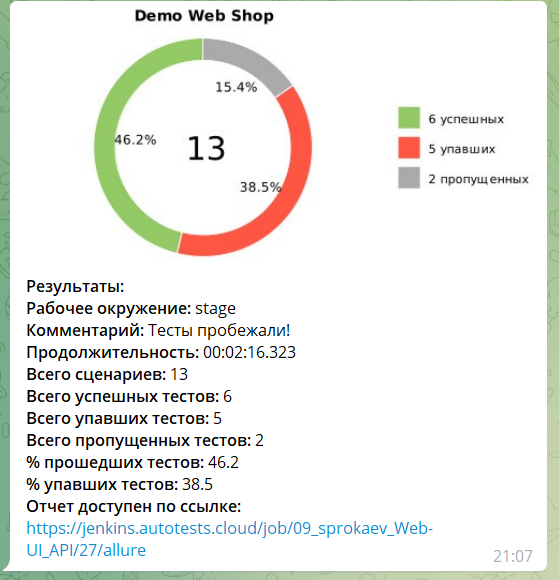

# Проект и автотесты разработаны для [Demo Web Shop](http://demowebshop.tricentis.com)

## Технологии и инструменты

<p  align="center">

<code></code>
<code></code>
<code></code>
<code></code>
<code></code>
<code></code>
<code></code>
<code></code>
<code></code>
<code></code>
<code></code>
</p>

* [Java](https://www.oracle.com/java/) - для написания тестов  
* [Gradle](https://gradle.org) - для сборки проекта
* [JUnit 5](https://junit.org/junit5/) - для запуска тестов
* [Selenide](https://selenide.org) - для тестирования UI
* [REST-Assured](https://rest-assured.io) - для тестирования API
* [Jenkins](https://www.jenkins.io/) - для обеспечения процесса непрерывной интеграции
* [Selenoid](https://aerokube.com/selenoid/) - для запуска UI тестов в [Docker containers](https://www.docker.com/resources/what-container)
* [Jira](https://www.atlassian.com/software/jira) - для отслеживания задач
* [Allure TestOps](https://docs.qameta.io/allure-testops/) и [Allure Report](http://allure.qatools.ru) - для управления тестами, анализа их прохождения и оформления отчетности
* [Telegram Bot](https://core.telegram.org/bots) - для оповещения о прохождении тестов

## Запуск и прохождение тестов:

### Команда для локального запуска тестов:

```
gradle clean test 
```
### Для удаленного запуска тестов воспользуйтесь [Jenkins](https://jenkins.autotests.cloud/job/09_sprokaev_Web-UI_API/build?delay=0sec)


### Видео-отчет о прохождении теста из Selenoid:


### Результаты прохождения тестов в [Allure Report](https://jenkins.autotests.cloud/job/09_sprokaev_Web-UI_API/27/allure/)


### Результаты прохождения тестов в Allure TestOps


### Результаты прохождения тестов в Jira


### Уведомление о прохождении тестов в Telegram

